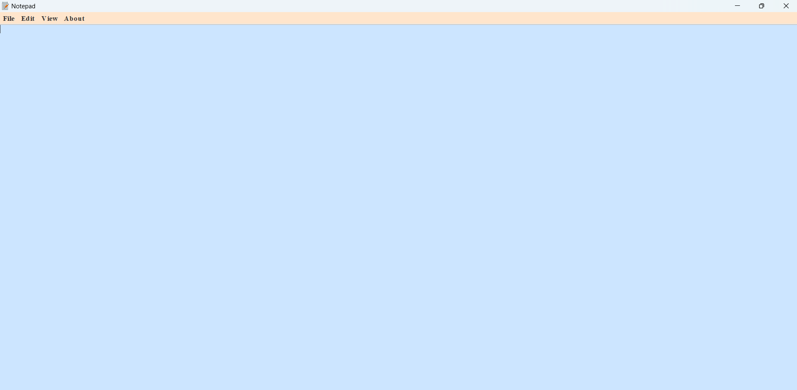
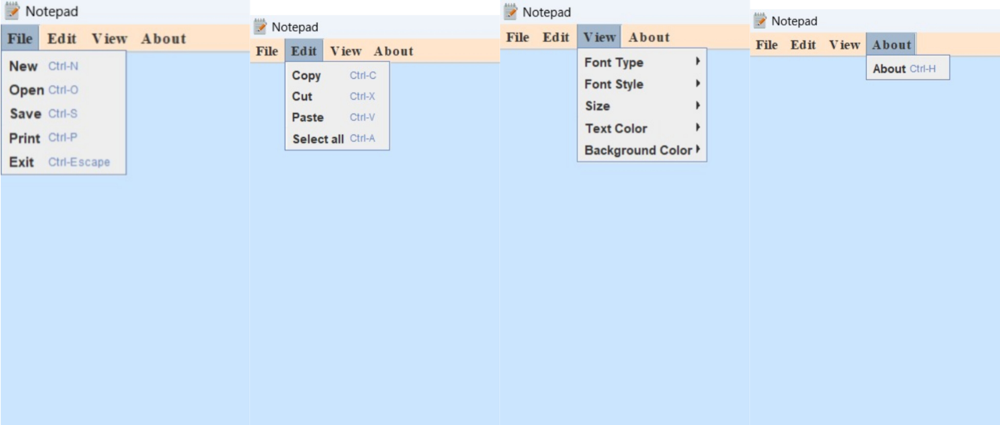
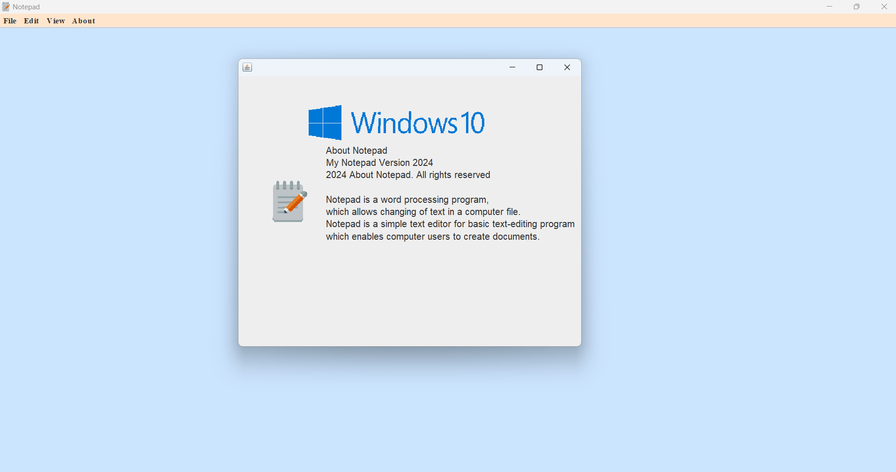
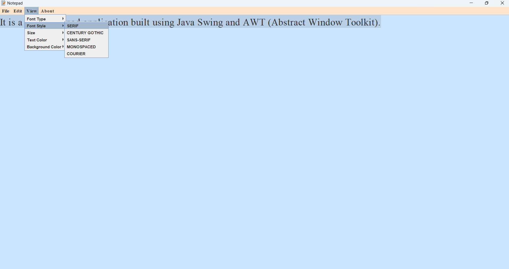
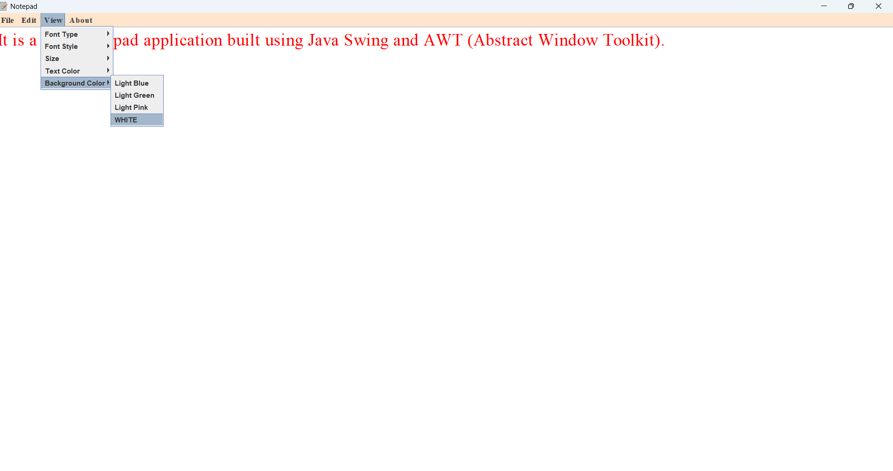

# Notepad app using Java 📝

    <i> It is a basic notepad application built using Java Swing and AWT (Abstract Window Toolkit). It provides users with a simple yet functional interface to create, edit, save, and open text files.
        It's a great starting point for beginners learning Java GUI programming and serves as a practical tool for everyday text editing needs.
        </i>

# 🖇️Specification:-

<ul>
    <li><b>Language : </b> JAVA </li>
    <li><b>GUI FrameWorks :</b> SWING AND AWT (Abstract Window Toolkit) </li>
    <li><b>Dependencies :</b> 
        JAVA DEVELOPMENT KIT (JDK)
    </li>
    <li><b>Development Environment :</b>
    Integrated Development Environment (IDE) such as IntelliJ IDEA. 
    </li>
  </ul>
 

 

# 🖇️Visuals:

 

 
 
 
  
  

# 🖇️Functionality :

🔹Create, edit, save, and open text files.

🔹Basic text formatting options such as font size, style, text color and background color.

🔹Copy, cut, paste functionality for text manipulation.

🔹File management features.

# 🖇️Future Enhancements :

🔹Additional text editing features like find and replace.

🔹Improved user interface design.

